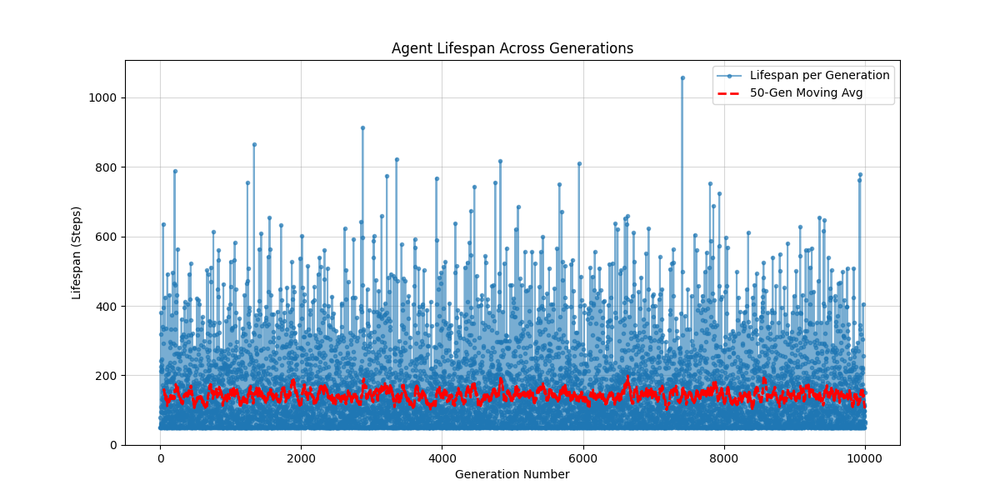
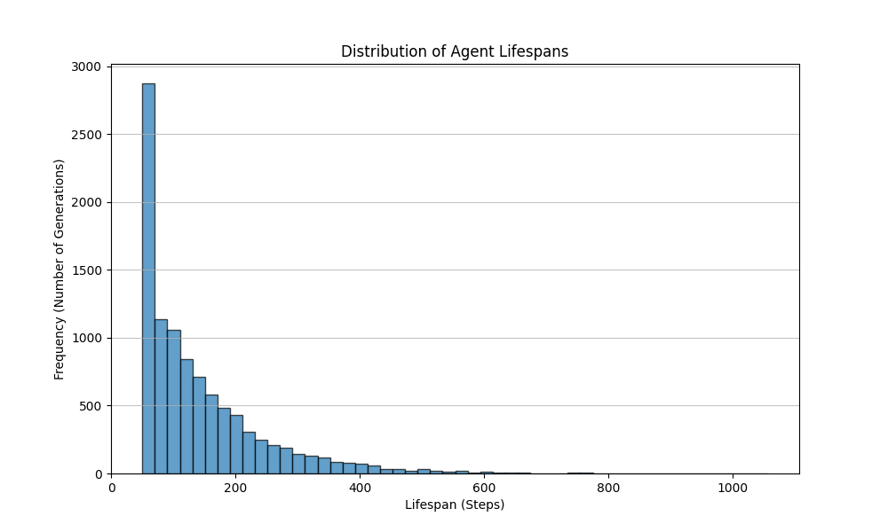

# Simulation Study: Behavioral Analogue of "Hope" in a Simple Agent

[](https://www.python.org/)
[](https://opensource.org/licenses/MIT)

## Table of Contents

1.  [Abstract](#abstract)
2.  [Motivation and Problem Statement](#motivation-and-problem-statement)
3.  [Methodology](#methodology)
    *   [Agent Model](#agent-model)
    *   [Environment Model](#environment-model)
    *   [Simulation Protocol](#simulation-protocol)
    *   [Data Collection](#data-collection)
4.  [Core Features](#core-features)
5.  [Project Structure](#project-structure)
6.  [Installation](#installation)
7.  [Usage](#usage)
    *   [Running the Simulation](#running-the-simulation)
    *   [Command-Line Arguments](#command-line-arguments)
8.  [Output Description](#output-description)
    *   [Log File (`simulation.log`)](#log-file-simulationlog)
    *   [PDF Report (`simulation_report.pdf`)](#pdf-report-simulation_reportpdf)
    *   [Plot Images (`.png`)](#plot-images-png)
9.  [Interpreting the Results](#interpreting-the-results)
    *   [Lifespan Trend Analysis](#lifespan-trend-analysis)
    *   [Lifespan Distribution Analysis](#lifespan-distribution-analysis)
    *   [Key Metrics and Considerations](#key-metrics-and-considerations)
    *   [**Important Disclaimer**](#important-disclaimer)
10. [Example Results (Visualizations)](#example-results-visualizations)
11. [Configuration Details](#configuration-details)
12. [Logging Details](#logging-details)
13. [Limitations](#limitations)
14. [Future Work and Extensions](#future-work-and-extensions)
15. [Contributing](#contributing)
16. [License](#license)
17. [Citation](#citation)

## Abstract

This project presents a computational simulation designed to explore a behavioral analogue of "hope" in a simple artificial agent. The agent operates within a stochastic environment characterized by frequent, uninformative "punishments" and rare, unpredictable "rewards." The agent possesses a basic decision mechanism: it can choose to terminate its current operational cycle ("give up" or "die") if it experiences a predefined number of consecutive punishments. Otherwise, it persists. By simulating this process over multiple "generations" (cycles), we can observe the agent's lifespan distribution and trends. The central question investigated is whether, under specific parameter configurations (relative frequency of rewards vs. agent's punishment tolerance), the agent exhibits sustained persistence indicative of *waiting* for a potential reward, a behavior we metaphorically term "hope." The simulation framework provides rigorous logging, detailed reporting including statistical summaries and visualizations, and configurable parameters for systematic exploration.

**Crucially, this simulation models behavior based on predefined rules and does not imply or investigate genuine consciousness, subjective experience, or sentience in the agent.** The term "hope" is used strictly as a metaphorical descriptor for the observable behavior of persistence in the face of adversity for a potential future gain.

## Motivation and Problem Statement

The concept of hope, resilience, and goal-directed persistence despite adversity is fundamental to many biological systems. As artificial intelligence systems become more complex and autonomous, understanding how simple mechanisms can lead to complex survival or persistence behaviors becomes increasingly relevant.

This simulation aims to address:

1.  **Emergent Persistence:** Can a simple, rule-based agent exhibit long-term persistence in a sparsely rewarding environment purely as a function of its internal threshold and the environmental statistics?
2.  **Behavioral Analogues:** Can we create simplified computational models that allow us to study behavioral patterns reminiscent of psychological concepts like hope or despair, even without modeling the underlying neuro-cognitive complexity?
3.  **Parameter Sensitivity:** How sensitive is the agent's "survival" (lifespan) to its internal "give-up" threshold relative to the frequency of positive reinforcement (rewards)?
4.  **Minimalism:** What is the minimal set of rules required for an agent to display behavior that *could be interpreted* as waiting or hoping for a better outcome?

This framework provides a tool for exploring these questions through controlled, repeatable computational experiments.

## Methodology

The simulation consists of three core components: the Agent, the Environment, and the Simulation Loop orchestrating their interaction.

### Agent Model

The agent is the entity whose behavior is under investigation. Two types are implemented:

1.  **`SimpleAgent`**:
    *   **State:** Tracks the number of consecutive punishments received since the last reward (or start of generation).
    *   **Parameters:** `give_up_threshold` (integer > 0).
    *   **Action:** At each step, after processing the environment's output (reward/punishment), it checks if `consecutive_punishments >= give_up_threshold`.
    *   **Decision:** If the threshold is met or exceeded, the agent decides to "give up," ending the current generation. Otherwise, it decides to "continue."
    *   **Reward Response:** Receiving a reward resets `consecutive_punishments` to 0.

2.  **`LearningAgent` (Experimental)**:
    *   **Inheritance:** Extends `SimpleAgent`.
    *   **Adaptive Threshold:** Possesses a `learning_rate` parameter. After each generation concludes, it adjusts its `give_up_threshold` based on its historical average lifespan. The goal is to heuristically tune its persistence based on past performance.
    *   **Mechanism:** A simple update rule (e.g., weighted average between current threshold and historical average lifespan) nudges the threshold. *Note: This is a basic heuristic, not sophisticated reinforcement learning.*

### Environment Model

The `HarshEnvironment` provides the external stimulus to the agent:

*   **Stochasticity:** At each simulation step, the environment yields either a "punishment" or a "reward."
*   **Parameters:** `reward_probability` (float between 0.0 and 1.0).
*   **Mechanism:** A pseudo-random number generator determines the outcome based on the `reward_probability`. `P(Reward) = reward_probability`, `P(Punishment) = 1 - reward_probability`.
*   **Stateless (mostly):** The environment's output at step `t` is independent of its output at step `t-1` (it doesn't "remember" past outputs, only tracks aggregate statistics).

### Simulation Protocol

The `simulation.py` script executes the core experimental loop:

1.  **Initialization:** The environment and the agent (with its initial threshold) are created based on the configuration.
2.  **Generational Loop:** The simulation runs for a specified `num_generations`.
3.  **Agent Reset:** At the start of each generation, the agent's state (counters, logs) is reset. For `LearningAgent`, the *learned threshold* persists across generations; for `SimpleAgent`, the threshold is effectively reset to the initial configuration value each time (by re-initializing or resetting explicitly).
4.  **Step Loop (within a generation):**
    *   The environment generates an outcome (reward/punishment).
    *   The agent observes the outcome and updates its internal state (increments step counter, updates consecutive punishments or resets it on reward).
    *   The agent makes the "continue" or "give up" decision based on its threshold.
    *   If "continue," the loop proceeds to the next step.
    *   If "give up," the generation ends. The agent's lifespan and other statistics for this generation are recorded.
    *   **Safety Break:** A `max_steps_per_generation` limit prevents infinite loops in edge cases. If hit, the generation terminates abnormally.
5.  **Learning Update (Optional):** If using `LearningAgent`, its threshold is updated after the generation ends, before the next one begins.
6.  **Termination:** The simulation stops after `num_generations` are completed or if interrupted manually.
7.  **Reporting:** After the simulation finishes, the collected data is passed to the reporting module.

### Data Collection

*   **Per-Generation Data:** For each generation, the simulation records:
    *   Generation number.
    *   Agent's total lifespan (steps lived).
    *   Total rewards received by the agent.
    *   Total punishments received by the agent.
    *   The reason for the generation ending (Threshold Reached or Max Steps Reached).
    *   The agent's threshold value used during that generation (relevant for `LearningAgent`).
    *   A detailed log of agent decisions within the generation (optional, for deep dives).
*   **Overall Environment Statistics:** Total steps simulated, total rewards/punishments issued by the environment.
*   **Detailed Log File:** A comprehensive timestamped log of events at configurable granularity (down to individual steps and decisions if set to TRACE or DEBUG).

## Core Features

*   **Configurable Parameters:** Easily adjust agent threshold, reward probability, number of generations via command-line arguments.
*   **Choice of Agents:** Run simulations with a fixed-threshold agent (`SimpleAgent`) or an adaptive one (`LearningAgent`).
*   **Rigorous Logging:** Detailed `.log` file output with multiple levels (TRACE, DEBUG, INFO, WARNING, ERROR) for debugging and analysis. Log entries are timestamped.
*   **Automated PDF Reporting:** Generates a `simulation_report.pdf` summarizing:
    *   Simulation configuration.
    *   Overall statistical results (mean, median, min, max lifespan, etc.).
    *   Visualizations (plots) embedded directly.
*   **Visualization:** Automatically generates and saves plots for:
    *   Lifespan trend across generations (with moving average).
    *   Histogram of lifespan distribution.
*   **Modular Design:** Code is organized into logical Python modules (`agent`, `environment`, `simulation`, `reporting`) for clarity and extensibility.
*   **Cross-Platform:** Written in standard Python, expected to run on Linux, macOS, and Windows.

## Project Structure
ai_hope_simulation/

├── agent.py # Agent class definitions (SimpleAgent, LearningAgent)

├── environment.py # Environment class definition (HarshEnvironment)

├── simulation.py # Core simulation loop logic

├── reporting.py # Plotting and PDF report generation functions

├── main.py # Main script: Argument parsing, config, orchestration

├── requirements.txt # Python dependencies

├── LICENSE # Project license file

├── lifespan_trend.png

├── lifespan_histogram.png

└── README.md # This detailed documentation file

## Installation

1.  **Clone the repository:**
    ```bash
    # Using HTTPS
    git clone https://github.com/doudol/The-Threshold-Gambit.git
    # Or using SSH
    # git clone git@github.com/doudol/The-Threshold-Gambit.git

    cd The-Threshold-Gambit
    ```
    

2.  **Create a Virtual Environment (Recommended):**
    ```bash
    python -m venv venv
    # On Windows
    .\venv\Scripts\activate
    # On macOS/Linux
    source venv/bin/activate
    ```

3.  **Install Dependencies:**
    ```bash
    pip install -r requirements.txt
    ```

## Usage

### Running the Simulation

The simulation is executed via the `main.py` script.

*   **Run with default settings:**
    ```bash
    python main.py
    ```
    This will use the default parameters defined in `main.py` (e.g., 100 generations, 1/28 reward probability, threshold 50, SimpleAgent).

*   **Run with custom settings using command-line arguments:**
    ```bash
    python main.py --generations 500 --reward_prob 0.01 --threshold 100 --agent LearningAgent --lr 0.02 --log_level DEBUG
    ```

### Command-Line Arguments

The following arguments can be used to customize the simulation run:

*   `--generations GENERATIONS` (int): Number of generations to simulate. Default: 100.
*   `--reward_prob REWARD_PROB` (float): Probability of receiving a reward in a single step (e.g., 0.05 for 1 in 20). Default: 1/28 (~0.0357).
*   `--threshold THRESHOLD` (int): The initial `give_up_threshold` for the agent (consecutive punishments). Default: 50.
*   `--agent {SimpleAgent,LearningAgent}` (str): Type of agent to use. Default: `SimpleAgent`.
*   `--lr LR` (float): Learning rate for the `LearningAgent`. Ignored for `SimpleAgent`. Default: 0.05.
*   `--log_level {TRACE,DEBUG,INFO,WARNING,ERROR}` (str): Set the logging level for console and file output. `TRACE` is the most verbose. Default: `INFO`.
    *(Note: Other parameters like `max_steps_per_generation` or output directory base can be modified directly in the `DEFAULT_CONFIG` dictionary within `main.py`)*

## Output Description

Upon successful completion, the script creates a timestamped subdirectory within `simulation_results/` (or the configured base directory). This directory contains:

### Log File (`simulation.log`)

*   **Content:** A detailed, timestamped record of the simulation execution. The level of detail depends on the `--log_level` setting.
    *   `INFO`: Shows simulation start/end, generation summaries, agent learning updates, report generation steps.
    *   `DEBUG`: Adds generation start/end markers, agent give-up reasons.
    *   `TRACE`: Adds per-step environment outcomes, agent state changes, and agent decisions (can become very large).
*   **Purpose:** Essential for debugging, verifying simulation logic, and performing fine-grained analysis of agent behavior within specific generations.

### PDF Report (`simulation_report.pdf`)

*   **Content:** A multi-page summary document containing:
    *   **Page 1:** Header, Generation Timestamp, Simulation Configuration Parameters.
    *   **Page 2+:** Overall Results (aggregate statistics like average/median/min/max lifespan), Environment Statistics (total steps, actual reward rate).
    *   **Subsequent Pages:** Embedded plots (Lifespan Trend, Lifespan Histogram).
    *   **(Optional):** Snippets from the detailed decision log for the first few generations (if enabled in config).
*   **Purpose:** Provides a high-level, human-readable summary of the experiment's setup and key findings. Ideal for sharing results.

### Plot Images (`.png`)

*   **`lifespan_trend.png`:** Shows the agent's lifespan for each generation, plotted sequentially. Includes a moving average line to help visualize trends over noise.
*   **`lifespan_histogram.png`:** Shows the frequency distribution of lifespans across all simulated generations. Helps understand the typical and extreme lifespans achieved by the agent under the given conditions.
*   **Purpose:** Visual aids for quickly grasping the agent's persistence behavior and variability over the simulation run. These are also embedded in the PDF.

## Interpreting the Results

The core idea is to analyze the agent's persistence (lifespan) in relation to its settings and the environment's harshness.

### Lifespan Trend Analysis

*   **Observe the Raw Data (Blue Line):** Shows high variability generation-to-generation due to the stochastic nature of rewards.
*   **Focus on the Moving Average (Red Dashed Line):** This smooths out short-term fluctuations.
    *   **Increasing Trend:** Suggests the agent (especially the `LearningAgent`, or a `SimpleAgent` with a well-chosen threshold) might be adapting or configured in a way that allows it to survive longer periods over time. This *could* be interpreted as the behavioral analogue of hope/resilience – the agent persists long enough to potentially benefit from rare rewards more often.
    *   **Decreasing Trend:** Suggests the agent is giving up more quickly over time. This might happen if the `LearningAgent` adapts its threshold downwards too aggressively, or if the `SimpleAgent`'s fixed threshold is too low for the environment.
    *   **Stable/Flat Trend:** Indicates the agent's lifespan is, on average, consistent across generations. This might represent a stable equilibrium or simply insufficient simulation time to observe a significant trend.
    *   **High Variance / Noise:** If the moving average itself is very jagged, it might indicate high environmental stochasticity dominates or that the moving average window is too small.

### Lifespan Distribution Analysis

*   **Shape of the Histogram:**
    *   **Skewed Left (Tail to the right):** Most generations are short, but a few are significantly longer. This is common when the threshold is relatively low compared to the expected reward interval. The agent often gives up quickly but occasionally gets lucky with early rewards.
    *   **Skewed Right (Tail to the left):** Most generations are relatively long, closer to the maximum possible or the typical reward interval. This might occur with a high threshold.
    *   **Bell-shaped/Normal (Approximate):** Suggests lifespans cluster around a central average.
    *   **Bimodal:** Two distinct peaks might suggest two different common outcomes or modes of behavior (e.g., giving up early vs. surviving until a reward).
*   **Central Tendency vs. Reward Interval:** Compare the mean/median lifespan to the expected number of steps per reward (`1 / reward_probability`).
    *   `Average Lifespan << Expected Reward Interval`: The agent rarely survives long enough to experience a reward. It's effectively operating in "despair."
    *   `Average Lifespan >= Expected Reward Interval`: The agent, on average, persists long enough that encountering rewards is statistically plausible. This persistence, driven by the threshold mechanism, is the behavior we link metaphorically to "hope."

### Key Metrics and Considerations

*   **Threshold Value:** This is the most critical parameter. How does changing the `agent_threshold` affect the lifespan metrics and plots? Is there an "optimal" threshold for maximizing average lifespan in a given environment?
*   **Reward Probability:** How does making rewards more or less frequent impact the agent's ability to survive, given a fixed threshold?
*   **Learning Agent Dynamics:** If using `LearningAgent`, examine the log file for how the `give_up_threshold` changes over generations. Does it converge? Does it oscillate? Does its final value seem reasonable given the environment?

### **Important Disclaimer**

**It cannot be overstated that this simulation demonstrates *behavioral patterns* arising from simple rules, not cognitive states.** Observing that an agent with threshold `T` survives longer in environment `E` than an agent with threshold `T'` does not prove the agent "feels hope." It demonstrates that the parameter `T` leads to more persistent behavior under the reward/punishment statistics of `E`. The interpretation of this persistence *as analogous* to hope is a conceptual leap made by the human observer.

## Example Results (Visualizations)

*Note: These plots are examples from a single run. Your results will vary based on configuration and random chance.*

**Lifespan Trend:** Shows lifespan per generation and a moving average trendline.


**Lifespan Histogram:** Shows the distribution of generation lifespans.



## Configuration Details

The primary configuration parameters are controlled via command-line arguments (see [Usage](#usage)). Key defaults and internal settings are in the `DEFAULT_CONFIG` dictionary in `main.py`:

*   `simulation_name`: Used in naming output files/directories.
*   `num_generations`: Total simulation cycles.
*   `reward_probability`: Likelihood of reward per step.
*   `agent_initial_threshold`: Starting (and fixed, for `SimpleAgent`) punishment tolerance.
*   `agent_type`: Selects `SimpleAgent` or `LearningAgent`.
*   `learning_rate`: Controls adaptation speed for `LearningAgent`.
*   `max_steps_per_generation`: Safety limit to prevent infinite loops.
*   `output_dir_base`: Root directory for saving results.
*   `log_level`: Controls verbosity of logs.
*   `log_to_console`, `log_to_file`: Toggles logging outputs.
*   `add_detailed_log_to_pdf`, `max_detailed_logs_in_pdf`: Control inclusion of verbose logs in the PDF report.

## Logging Details

The Python `logging` module is used for detailed output.

*   **Levels:**
    *   `ERROR`: Critical errors preventing simulation continuation.
    *   `WARNING`: Unexpected events or potential issues (e.g., hitting max steps).
    *   `INFO`: High-level progress (start/end, generation summaries). **Default level.**
    *   `DEBUG`: More detailed progress markers (generation start/end markers, give-up reasons).
    *   `TRACE` (Custom Level 5): Extremely detailed step-by-step logging of environment outcomes, agent state changes, and decisions. Useful for intense debugging but generates very large log files.
*   **Output:** Logs are simultaneously sent to the console (if `log_to_console=True`) and saved to `simulation.log` within the run's output directory (if `log_to_file=True`).

## Limitations

*   **Agent Simplicity:** The agent's decision logic is extremely basic (a simple counter and threshold). It lacks memory beyond consecutive punishments, planning capabilities, or complex representations of the environment. (might consider a more complex structure in the future)
*   **Environment Simplicity:** The environment provides only binary, context-free feedback (reward/punishment). There's no spatial aspect, no resource management, no interaction with other agents.
*   **Reward/Punishment Nature:** "Rewards" and "Punishments" are abstract signals; they don't carry intrinsic value or cost within the simulation beyond their effect on the agent's counter.
*   **Learning Mechanism (LearningAgent):** The learning implemented is a simple heuristic, not grounded in established reinforcement learning theory like Q-learning or policy gradients. Its adaptation might not be optimal.
*   **Metaphorical Interpretation:** As stressed previously, attributing "hope" is an external interpretation of observed behavior, not a reflection of any internal state within the simulation.

## Future Work and Extensions

*   **More Complex Agents:** Implement agents using simple RNNs, Q-learning, or other basic RL techniques to see if more sophisticated learning leads to different persistence patterns.
*   **Richer Environments:** Introduce variable reward magnitudes, punishment costs, environmental states, or spatial elements.
*   **Agent Memory:** Allow agents to remember more than just consecutive punishments (e.g., recent reward frequency).
*   **Population Dynamics:** Simulate multiple agents competing or coexisting.
*   **Parameter Sweeps:** Automate running the simulation across wide ranges of thresholds and reward probabilities to map the behavior landscape.
*   **Advanced Reporting:** Include more sophisticated statistical analysis (e.g., time series analysis on lifespan) and visualization options in the report.

## Contributing

Contributions are welcome! If you find bugs, have suggestions for improvements, or want to add new features (like different agent types or environment dynamics), please feel free to:

1.  Open an [issue](https://github.com/doudol/The-Threshold-Gambit/issues) on the repository to discuss the change.
2.  Fork the repository, make your changes, and submit a pull request.

Please try to maintain the existing code style and ensure adequate documentation/comments for new additions.

## License

This project is licensed under the MIT License. See the [LICENSE](LICENSE) file for details.

## Citation

If you use this simulation framework or its results in your research or work, please consider citing it:
[Doudol]. ([2025]). AI Hope Simulation: A Framework for Studying Behavioral Persistence [Software]. Available from https://github.com/doudol/The-Threshold-Gambit
